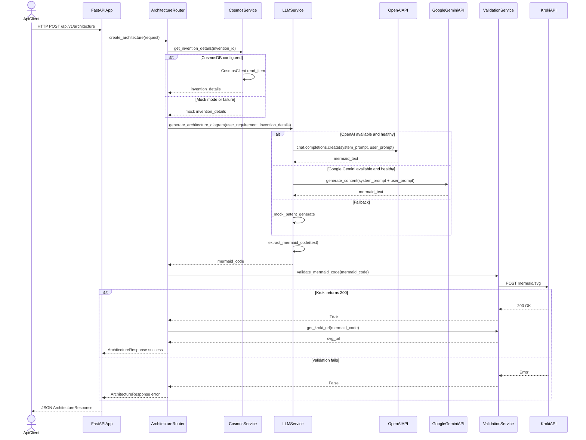
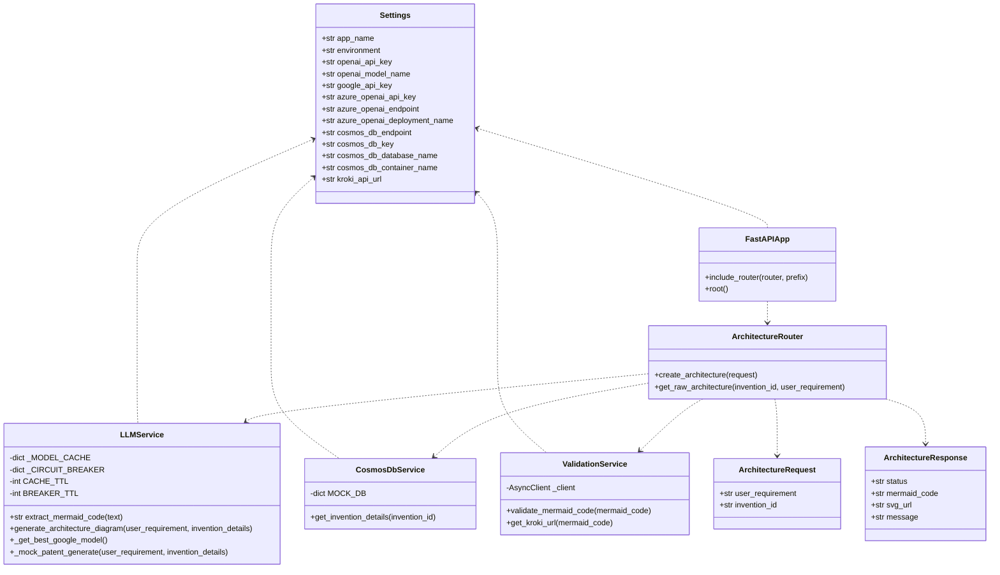

<!-- Generated by sourcery-ai[bot]: start review_guide -->

## Reviewer's Guide

Introduces a FastAPI-based Architecture Generator API that retrieves invention metadata (mocked or from Cosmos DB), calls OpenAI and/or Google Gemini to generate MermaidJS architecture diagrams, validates them via Kroki, and exposes endpoints plus simple test scripts, all configured via new settings and requirements files.

#### Sequence diagram for architecture generation request flow

#### Updated class diagram for core API models and services

### File-Level Changes

| Change | Details | Files |
| ------ | ------- | ----- |
| Add LLM-backed architecture diagram generation service with provider failover and Mermaid post-processing. | <ul><li>Implemented extract_mermaid_code to normalize and sanitize MermaidJS output, including smart semicolon handling and `end` keyword fixes.</li><li>Added generate_architecture_diagram which builds system/user prompts, calls OpenAI first with circuit breaker logic, falls back to Google Gemini model discovery and invocation, and finally to a deterministic mock generator.</li><li>Introduced simple in-memory caches for Google model discovery and provider-specific circuit breakers to mitigate rate limits.</li></ul> | `app/services/llm_service.py` |
| Introduce Cosmos DB-backed (with mock fallback) invention details lookup. | <ul><li>Defined MOCK_DB with multiple realistic patent-style invention records for offline/demo use.</li><li>Implemented get_invention_details to return mock data when Cosmos is disabled or endpoint contains 'mock', otherwise read an item from Cosmos DB container with error fallback to mock data.</li></ul> | `app/services/cosmos_db.py` |
| Add Mermaid validation and Kroki integration utilities. | <ul><li>Created validate_mermaid_code using a shared httpx.AsyncClient to POST Mermaid code to Kroki’s mermaid/svg endpoint with basic retry on timeouts/network errors.</li><li>Implemented get_kroki_url that compresses and base64-encodes Mermaid code into a Kroki URL, normalizing semicolons to newlines first.</li></ul> | `app/services/validation.py` |
| Expose architecture generation API endpoints in FastAPI and wire services together. | <ul><li>Added POST /architecture endpoint that fetches invention details, invokes the LLM service, handles INVALID_INTENT, validates the Mermaid output, generates a Kroki SVG URL when valid, and returns an ArchitectureResponse.</li><li>Added GET /architecture/{invention_id}/raw endpoint that reuses the POST handler with a default requirement to return raw Mermaid text for an invention.</li><li>Wired the router into the FastAPI app with the /api/v1 prefix and added a simple root welcome endpoint.</li></ul> | `app/api/routes.py` `app/main.py` |
| Define Pydantic models, configuration, and dependencies for the new API. | <ul><li>Introduced ArchitectureRequest/ArchitectureResponse Pydantic models for request/response schemas.</li><li>Added Settings class using pydantic-settings to configure API keys, Cosmos DB, and Kroki endpoint via .env.</li><li>Created requirements.txt listing FastAPI, pydantic, httpx, OpenAI, Azure Cosmos, and Google Generative AI dependencies, plus an example .env file placeholder.</li></ul> | `app/models/schemas.py` `app/core/config.py` `requirements.txt` `.env.example` |
| Add basic test scripts to exercise the new endpoints via TestClient. | <ul><li>Implemented test_poc.py to hit the POST /api/v1/architecture endpoint with three scenarios: normal request, invalid intent, and a prompt meant to simulate LLM errors.</li><li>Added test_raw.py to call GET /api/v1/architecture/{invention_id}/raw and print/inspect the raw Mermaid output for newline and header correctness.</li></ul> | `test_poc.py` `test_raw.py` |

---

Tips and commands

#### Interacting with Sourcery

- **Trigger a new review:** Comment `@sourcery-ai review` on the pull request.
- **Continue discussions:** Reply directly to Sourcery's review comments.
- **Generate a GitHub issue from a review comment:** Ask Sourcery to create an
  issue from a review comment by replying to it. You can also reply to a
  review comment with `@sourcery-ai issue` to create an issue from it.
- **Generate a pull request title:** Write `@sourcery-ai` anywhere in the pull
  request title to generate a title at any time. You can also comment
  `@sourcery-ai title` on the pull request to (re-)generate the title at any time.
- **Generate a pull request summary:** Write `@sourcery-ai summary` anywhere in
  the pull request body to generate a PR summary at any time exactly where you
  want it. You can also comment `@sourcery-ai summary` on the pull request to
  (re-)generate the summary at any time.
- **Generate reviewer's guide:** Comment `@sourcery-ai guide` on the pull
  request to (re-)generate the reviewer's guide at any time.
- **Resolve all Sourcery comments:** Comment `@sourcery-ai resolve` on the
  pull request to resolve all Sourcery comments. Useful if you've already
  addressed all the comments and don't want to see them anymore.
- **Dismiss all Sourcery reviews:** Comment `@sourcery-ai dismiss` on the pull
  request to dismiss all existing Sourcery reviews. Especially useful if you
  want to start fresh with a new review - don't forget to comment
  `@sourcery-ai review` to trigger a new review!

#### Customizing Your Experience

Access your [dashboard](https://app.sourcery.ai) to:
- Enable or disable review features such as the Sourcery-generated pull request
  summary, the reviewer's guide, and others.
- Change the review language.
- Add, remove or edit custom review instructions.
- Adjust other review settings.

#### Getting Help

- [Contact our support team](mailto:support@sourcery.ai) for questions or feedback.
- Visit our [documentation](https://docs.sourcery.ai) for detailed guides and information.
- Keep in touch with the Sourcery team by following us on [X/Twitter](https://x.com/SourceryAI), [LinkedIn](https://www.linkedin.com/company/sourcery-ai/) or [GitHub](https://github.com/sourcery-ai).

<!-- Generated by sourcery-ai[bot]: end review_guide -->
